<p align="center">
  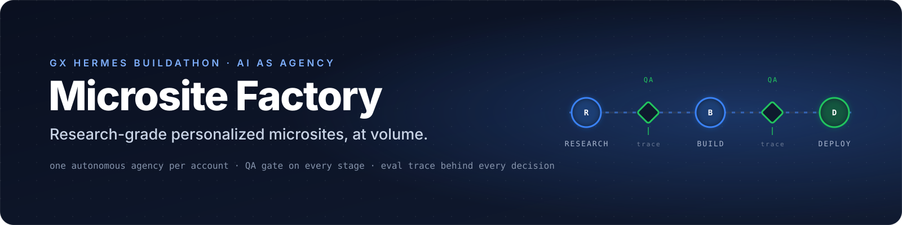
</p>

<p align="center">
  <b>Paste an account list. An autonomous agency researches every company, writes a cited, personalized microsite for each one, gates it through QA at every stage, and ships it to its own live URL.</b>
</p>

<p align="center">
  <a href="https://microsite-factory-console.pages.dev"></a>
  
  
  
</p>

<p align="center">
  
  
  
  
  
  <a href="LICENSE"></a>
</p>

<p align="center">
  <a href="https://microsite-factory-console.pages.dev"><b>Open the fleet board</b></a> ·
  <a href="https://delhivery-com-cfo.pages.dev">Sample site: Delhivery, CFO</a> ·
  <a href="https://razorpay-com-cto.pages.dev">Sample site: Razorpay, CTO</a> ·
  <a href="docs/microsite-factory-prd.md">Read the PRD</a>
</p>

<br>

<picture>
  <source media="(prefers-color-scheme: dark)" srcset="docs/media/console-fleet-board-dark.png">
  <source media="(prefers-color-scheme: light)" srcset="docs/media/console-fleet-board-light.png">
  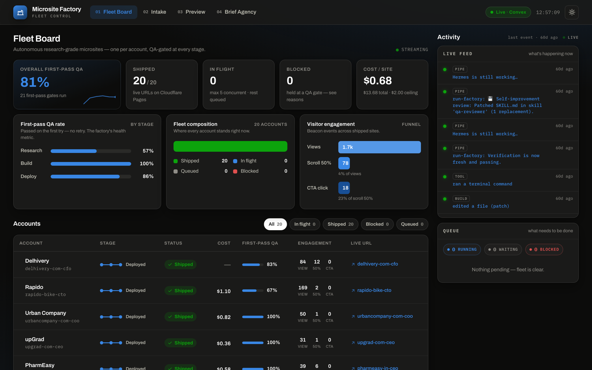
</picture>

<p align="center"><sub>The operator console, reading live from Convex. Every number on this board was written by the agent through a QA gate.</sub></p>

<br>

## Why this exists

Your top 50 accounts get human attention. The next 500 get merge-tag email that reads as spam and burns your sender reputation. The gap is **research-grade personalization at volume**: a page that demonstrably understands the account's stack, funding, hiring, and likely objection, so a CxO reads for 15 seconds and thinks *"this is actually about us."*

Site generation is a solved problem. The **agency around it** is not: the research, the gates that refuse shallow work, and the trace that explains every decision. That agency is the product.

> **Restraint is a feature.** If research confidence falls below 0.5, the account is *blocked*, not faked. A shallow site is worse than no site.

<br>

## The fleet, today

Numbers below are read from the live Convex board, not typed in.

| Shipped | Blocked | Total cost | Cost / site | First-pass QA | Views | Scroll 50% | CTA clicks |
|:---:|:---:|:---:|:---:|:---:|:---:|:---:|:---:|
| **20** live URLs | **0** | **$13.68** | **$0.68** (ceiling $2.00) | **81%** of gates passed first try | **1,740** | **78** | **18** |

First-pass QA by stage, the factory's single health metric: research **57%**, build **100%**, deploy **86%**. The research gate is the strict one, which is exactly where you want the strictness.

<br>

## Four design systems, derived from the target

The page's identity comes from the *target's* world. The researcher captures brand hints (dominant hue, register, a phrase of their own vocabulary), and the builder maps them onto one of four fixed design systems with distinct type pairings. Never one template with a logo swap. Each page spends all of its boldness on **one signature element** derived from the research, and everything else stays quiet.

<table>
  <tr>
    <td width="50%" valign="top">
      <a href="https://delhivery-com-cfo.pages.dev">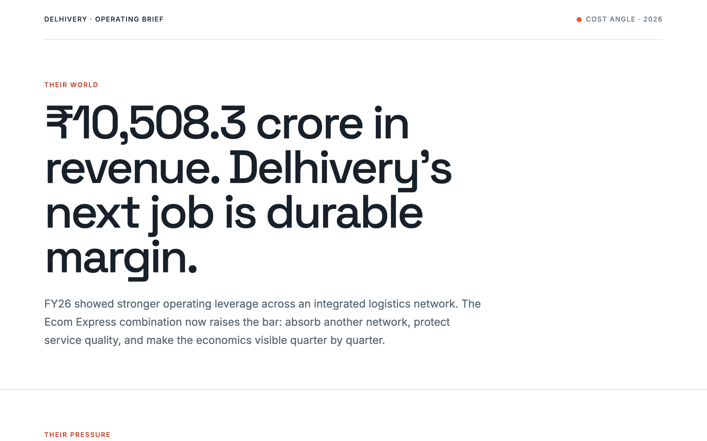</a>
      <br><b>Delhivery · CFO · logistics</b><br>
      <sub><b>signal</b> · cost angle · financial lens · 4 cited claims · confidence 0.84</sub><br>
      <sub>Signature: an FY26 operating-leverage scoreboard contrasting revenue growth and EBITDA margin with the decline in net profit.</sub>
    </td>
    <td width="50%" valign="top">
      <a href="https://razorpay-com-cto.pages.dev">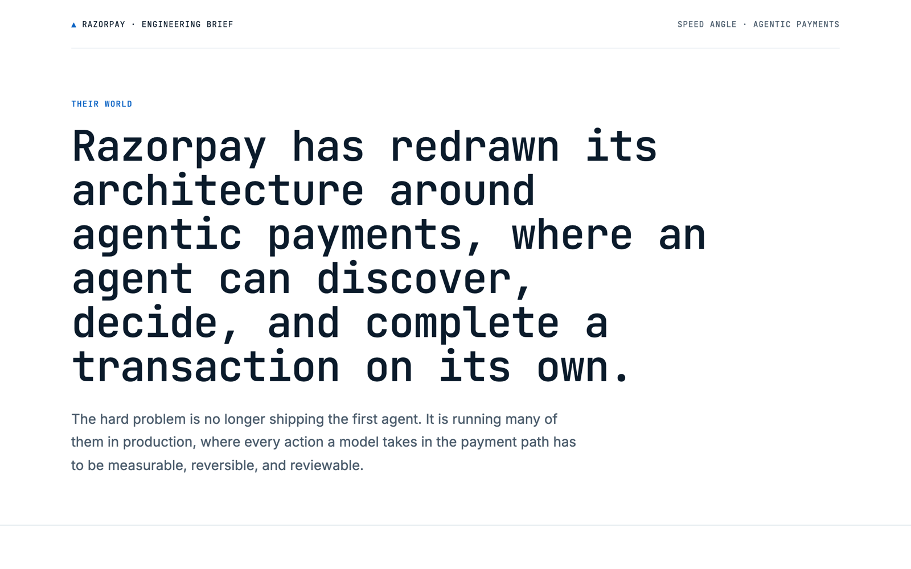</a>
      <br><b>Razorpay · CTO · payments</b><br>
      <sub><b>terminal</b> · speed angle · technical lens · 3 cited claims · confidence 0.90</sub><br>
      <sub>Signature: a terminal panel tracing one agent payment request through retrieval, function call, eval gate, guardrail, and human review.</sub>
    </td>
  </tr>
  <tr>
    <td width="50%" valign="top">
      <a href="https://phonepe-com-cto.pages.dev">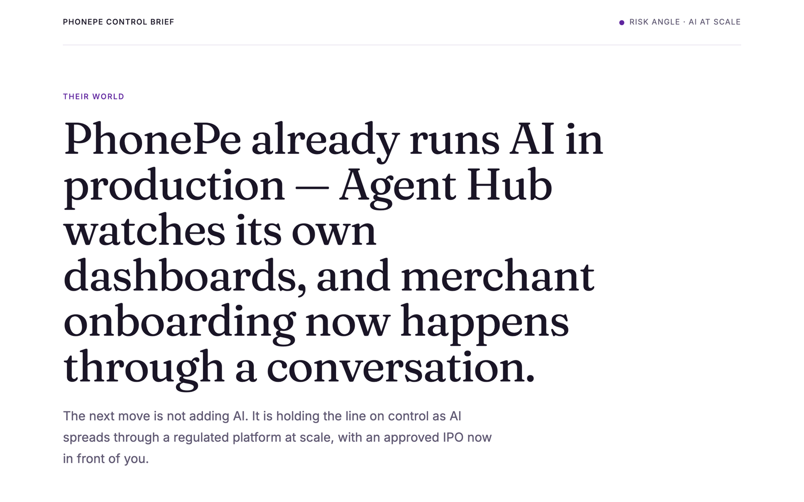</a>
      <br><b>PhonePe · CTO · payments</b><br>
      <sub><b>ledger</b> · risk angle · technical lens · 4 cited claims · confidence 0.90</sub><br>
      <sub>Signature: an AI audit trail, a hairline ledger of one AI-touched action with a control stamp per entry, derived from PhonePe's Agent Hub.</sub>
    </td>
    <td width="50%" valign="top">
      <a href="https://zerodha-com-cto.pages.dev">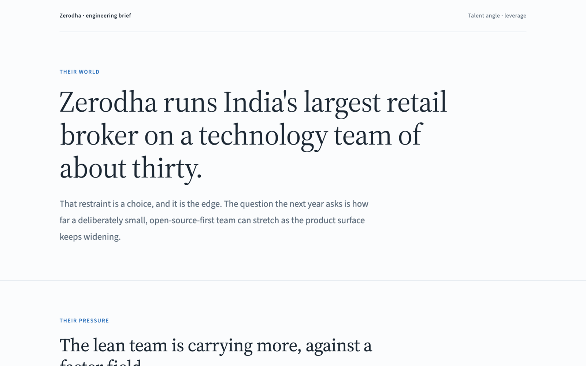</a>
      <br><b>Zerodha · CTO · broking</b><br>
      <sub><b>clinic</b> · talent angle · technical lens · 4 cited claims · confidence 0.85</sub><br>
      <sub>Signature: a calm leverage figure pairing "~30 engineers" with a cited "~15.8% of India's broking market, run in-house".</sub>
    </td>
  </tr>
</table>

| System | Register | Display / body faces | Character |
|---|---|---|---|
| **ledger** | precise, serious (finserv, legal) | Fraunces / Inter | disciplined grid, generous white, one hairline accent in their hue |
| **terminal** | technical (devtools, infra) | JetBrains Mono / Inter | mono display, code-block signature, dark-on-light, never a dark theme |
| **clinic** | calm, clinical (health, edtech) | Source Serif 4 / Source Sans 3 | soft radius, muted palette, spacious line-height |
| **signal** | bold (consumer-ish B2B, martech) | Space Grotesk / Inter | oversized display type, one saturated accent from their hue |

Three "AI-tell" looks are banned and auto-fail QA: cream background with high-contrast serif and terracotta; near-black with acid green; hairline broadsheet with zero radius and dense columns.

<details>
<summary><b>More from the fleet</b> (12 more accounts, click to expand)</summary>
<br>
<table>
  <tr>
    <td width="25%"><a href="https://groww-in-cto.pages.dev">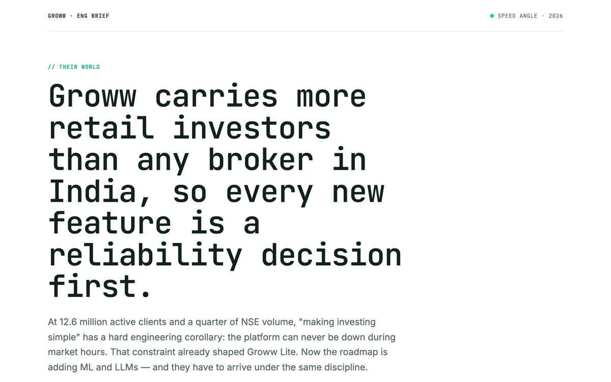</a><br><sub><b>Groww</b> · CTO<br>terminal · speed</sub></td>
    <td width="25%"><a href="https://pharmeasy-in-ceo.pages.dev">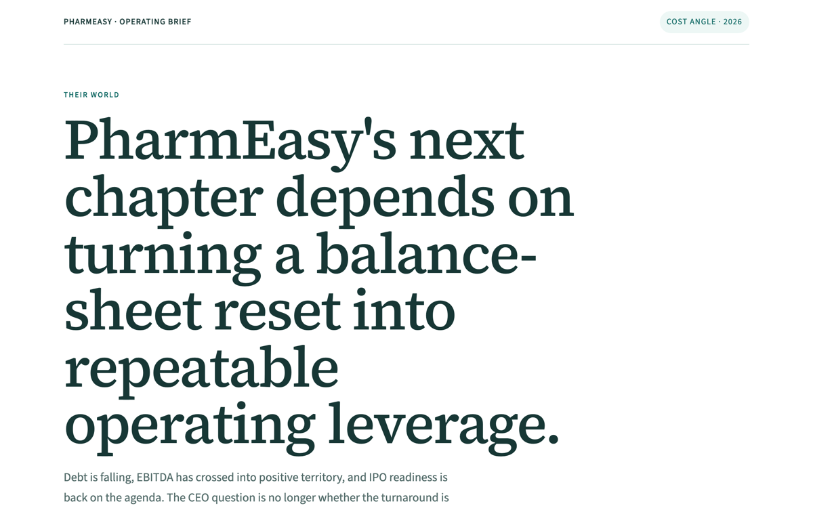</a><br><sub><b>PharmEasy</b> · CEO<br>clinic · cost</sub></td>
    <td width="25%"><a href="https://swiggy-com-coo.pages.dev">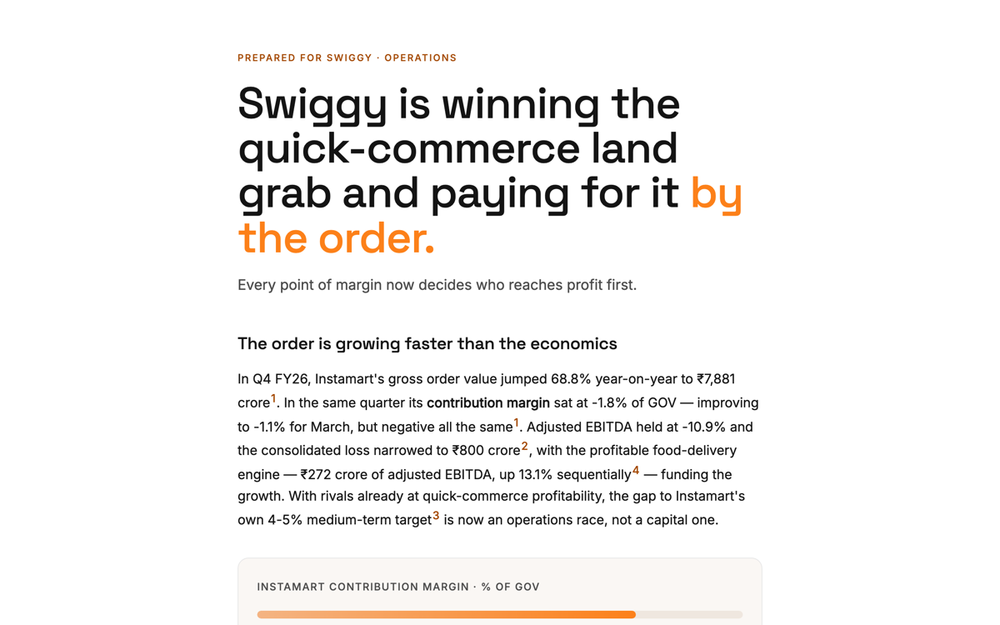</a><br><sub><b>Swiggy</b> · COO<br>signal · competition</sub></td>
    <td width="25%"><a href="https://policybazaar-com-cfo.pages.dev">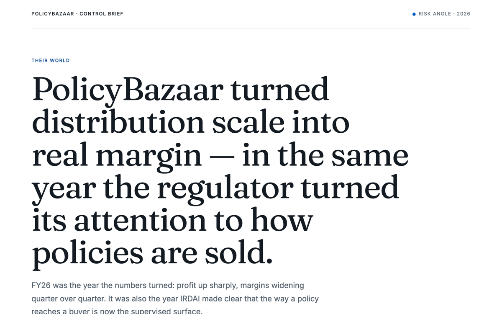</a><br><sub><b>PolicyBazaar</b> · CFO<br>ledger · risk</sub></td>
  </tr>
  <tr>
    <td width="25%"><a href="https://nykaa-com-cmo.pages.dev">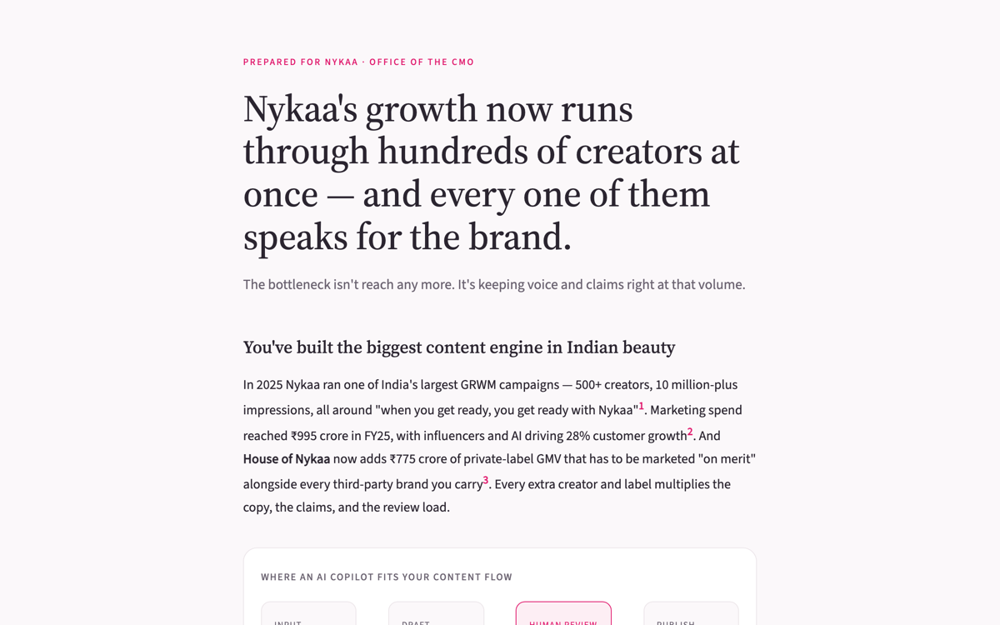</a><br><sub><b>Nykaa</b> · CMO<br>clinic · speed</sub></td>
    <td width="25%"><a href="https://dream11-com-cto.pages.dev">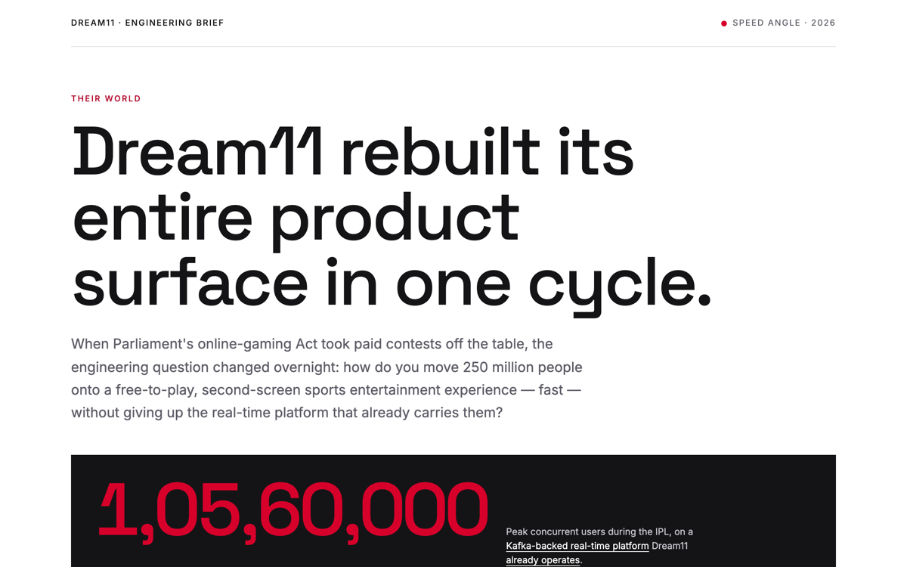</a><br><sub><b>Dream11</b> · CTO<br>signal · speed</sub></td>
    <td width="25%"><a href="https://meesho-com-coo.pages.dev">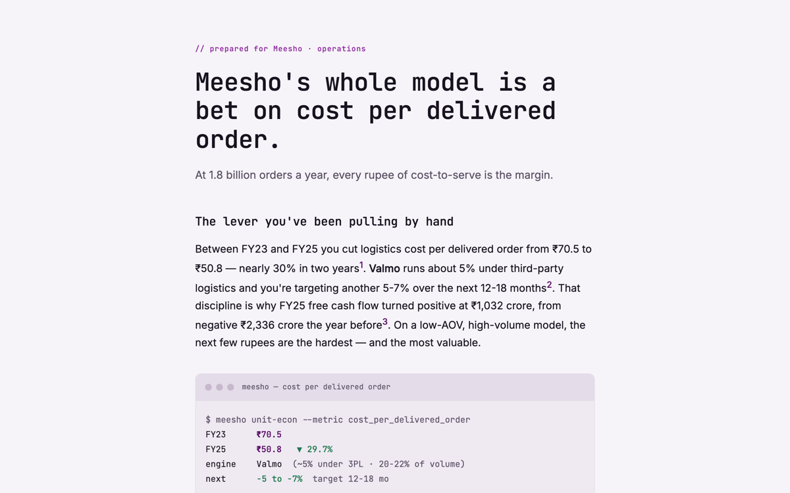</a><br><sub><b>Meesho</b> · COO<br>terminal · cost</sub></td>
    <td width="25%"><a href="https://freshworks-com-cmo.pages.dev">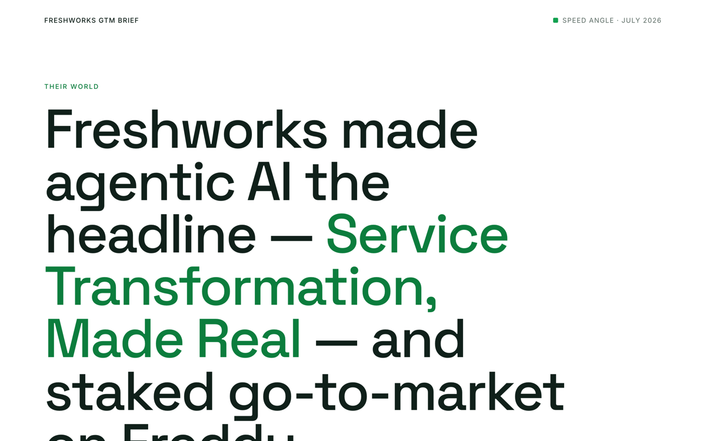</a><br><sub><b>Freshworks</b> · CMO<br>signal · speed</sub></td>
  </tr>
  <tr>
    <td width="25%"><a href="https://rapido-bike-cto.pages.dev">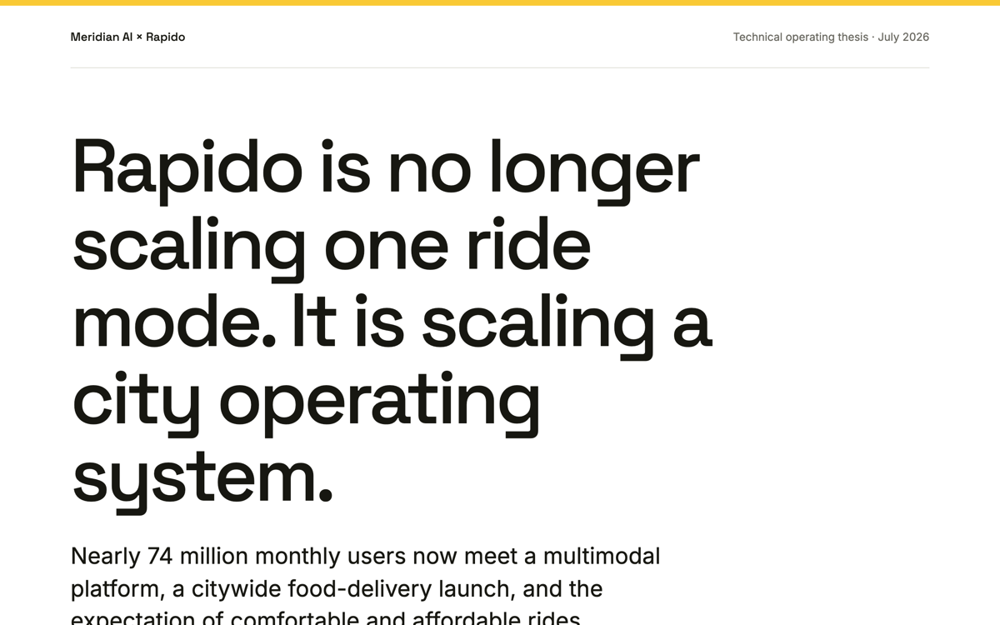</a><br><sub><b>Rapido</b> · CTO<br>signal · speed</sub></td>
    <td width="25%"><a href="https://urbancompany-com-coo.pages.dev">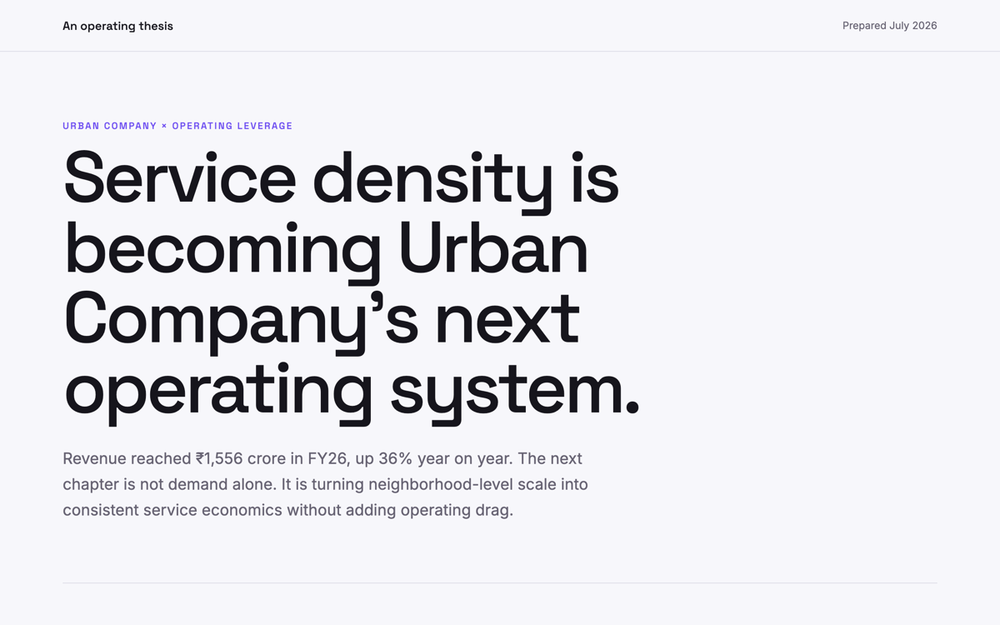</a><br><sub><b>Urban Company</b> · COO<br>signal · cost</sub></td>
    <td width="25%"><a href="https://upgrad-com-ceo.pages.dev">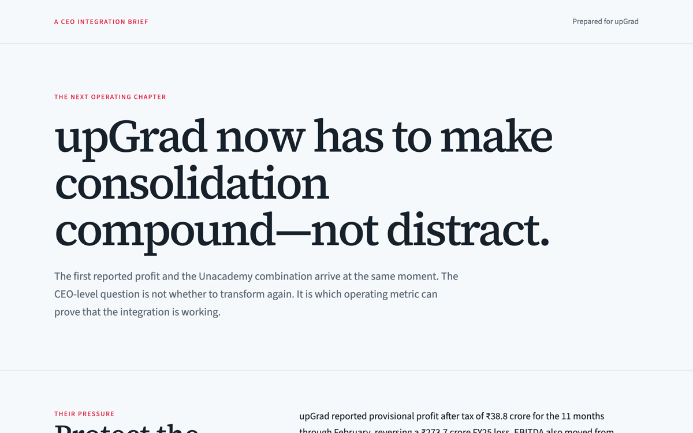</a><br><sub><b>upGrad</b> · CEO<br>clinic · cost</sub></td>
    <td width="25%"><a href="https://cred-club-ceo.pages.dev">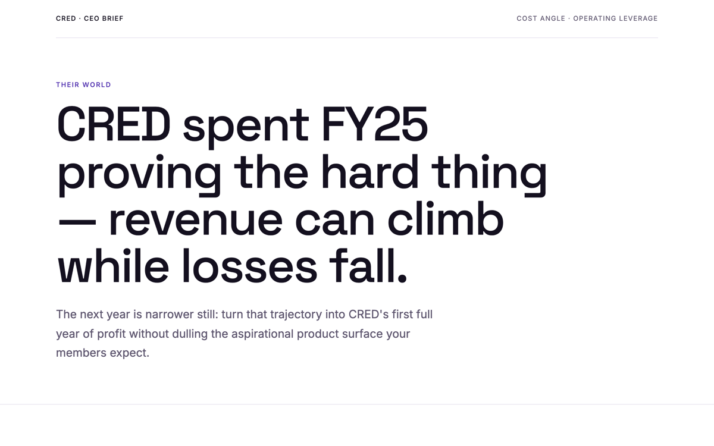</a><br><sub><b>CRED</b> · CEO<br>signal · cost</sub></td>
  </tr>
</table>

<p><b>Every page is a single HTML file, responsive to 360px, with visible focus states and reduced-motion support.</b></p>
<table>
  <tr>
    <td width="20%" valign="top">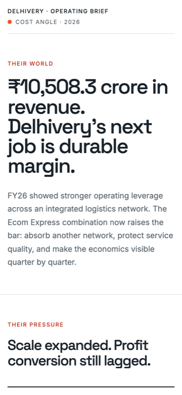<br><sub>Delhivery · 390px</sub></td>
    <td width="20%" valign="top">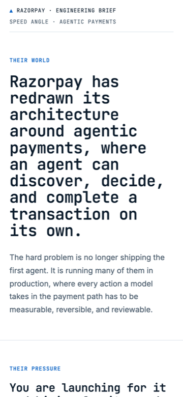<br><sub>Razorpay · 390px</sub></td>
    <td width="30%" valign="top">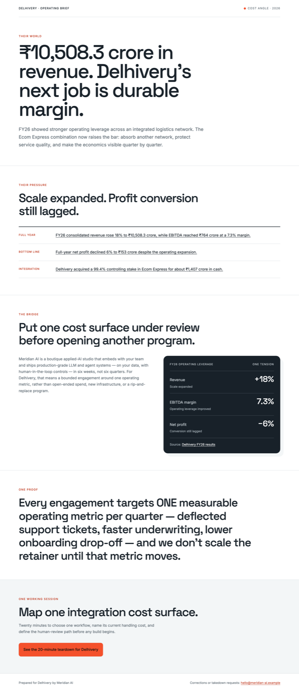<br><sub>Delhivery · full page · the fixed narrative spine: their world → their pressure → the bridge → one proof → one CTA</sub></td>
    <td width="30%" valign="top">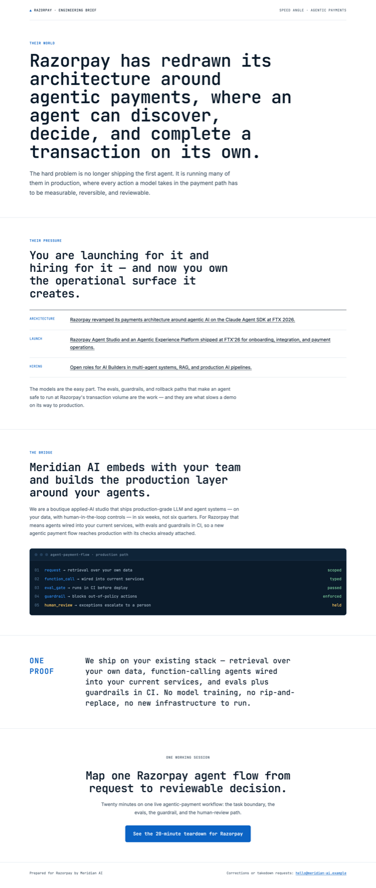<br><sub>Razorpay · full page · same spine, different design system</sub></td>
  </tr>
</table>
</details>

<br>

## How it works

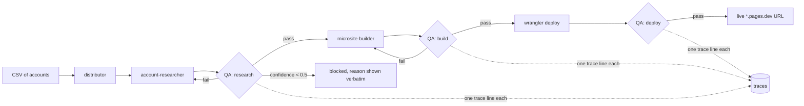
```mermaid
flowchart LR
    CSV[CSV of accounts] --> D[distributor]
    D --> R[account-researcher]
    R --> Q1{QA: research}
    Q1 -- pass --> B[microsite-builder]
    Q1 -- fail --> R
    Q1 -- "confidence < 0.5" --> BLK[blocked, reason shown verbatim]
    B --> Q2{QA: build}
    Q2 -- pass --> W[wrangler deploy]
    Q2 -- fail --> B
    W --> Q3{QA: deploy}
    Q3 -- pass --> URL[live *.pages.dev URL]
    Q1 & Q2 & Q3 -. "one trace line each" .-> T[(traces)]
```

1. **Intake.** Paste or upload a CSV with company, domain, contact title, and vertical. The console validates client-side and dedupes on domain plus title.
2. **Research.** The agent picks a *reader lens* from the contact title (technical, financial, or GTM) and runs three to six sourced Linkup queries. The packet must contain at least five findings, every one with a real source URL, plus brand hints and the reader's most likely objection. No source, no finding.
3. **Build.** The builder chooses one of five storytelling angles (cost, speed, risk, talent, competition) from the strongest findings and the objection, writes 250 to 400 words along a fixed narrative spine, cites the findings on the page, and embeds a three-event beacon. Product claims may come **only** from the operator's positioning memory.
4. **QA at every gate.** One reviewer skill with three rubrics. Research: spot-fetch two cited URLs and confirm the claim is supported, not adjacent. Build: reject any product claim absent from positioning memory, any banned look, any missing signature element. Deploy: confirm the live URL's content hash matches the QA-passed build and the beacon fires once. A failed gate gets one retry with the failure list injected, then the account is blocked.
5. **Deploy.** Each account gets its own Cloudflare Pages project and URL.
6. **Watch.** The board live-updates from Convex: stage, status, cost, first-pass QA rate, blocked reasons verbatim, beacon counts, and a minute-by-minute feed of what the agent is doing.

<br>

## The operator console

Four screens. Editing is **strategy, not pixels**: the operator picks a different angle or types an instruction, and the change re-enters the full builder → QA → deploy pipeline. There is no direct HTML edit path, because the moment one exists, positioning enforcement, traces, and the whole story break at once.

<table>
  <tr>
    <td width="50%" valign="top">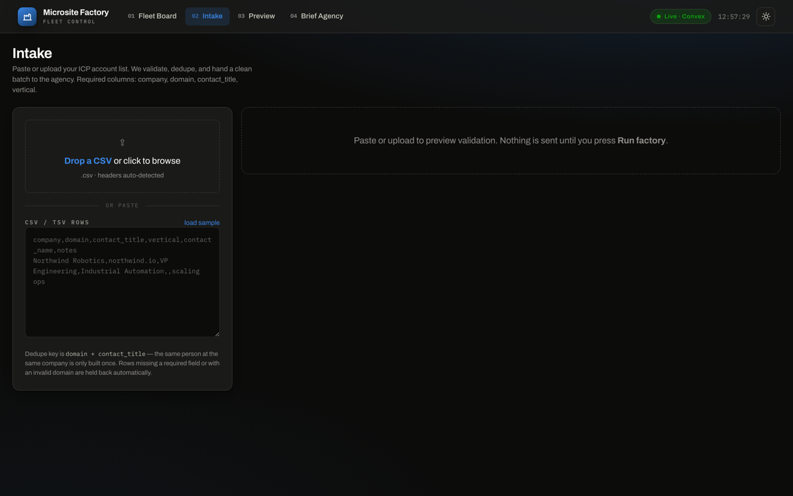<br><b>Intake</b><br><sub>CSV upload or paste, client-side validation, dedupe on domain plus title, a cost confirm above 25 rows, then one signed POST to the run-factory webhook.</sub></td>
    <td width="50%" valign="top">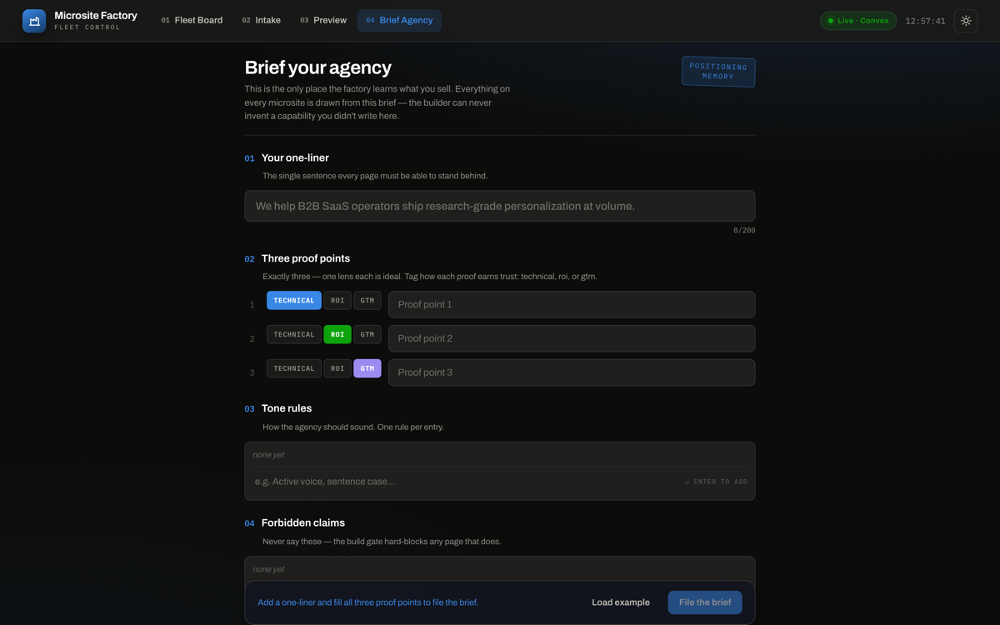<br><b>Brief your agency</b><br><sub>A form that is secretly a memory editor: one-liner, three tagged proof points, tone rules, forbidden claims, target verticals. Saving rewrites the agent's positioning memory.</sub></td>
  </tr>
</table>

**Preview + steer** ([open it](https://microsite-factory-console.pages.dev/preview/delhivery-com-cfo)) puts the live site next to its pipeline track, the five angle archetypes, and a free-text instruction box. Pick "risk" instead of "cost", or type *"lead with their margin story and make the hero punchier"*, and the account flips to *in progress* on the board while the builder, the QA gate, and the deploy run again. Every regenerate leaves a trace.

<br>

## The agent: four skills

The agent is [Hermes](https://github.com/NousResearch/hermes-agent), a Python daemon running a gateway and a kanban dispatcher. Its behavior lives entirely in four skill files under [`skills/`](skills/), installed into the runtime by a script so repo and runtime never drift.

| Skill | Role | The contract it enforces |
|---|---|---|
| [**distributor**](skills/distributor/SKILL.md) | Orchestrator. Parses intake, creates one kanban task per account, enforces stage order and budgets. | research → QA → build → QA → deploy → QA. One retry on QA fail, then block. Confidence below 0.5 means no build. Max 5 in flight, first account always sequential. $2 per account with graceful degradation. |
| [**account-researcher**](skills/account-researcher/SKILL.md) | Reader-lens research through `linkup-research.mjs`, the only research path in the pipeline. | At least 5 findings, every one with a real source URL, at least 3 with hook strength 3 or more, a specific likely objection, a confidence score. Never invents stack details from the vertical name. |
| [**microsite-builder**](skills/microsite-builder/SKILL.md) | Angle selection, fixed narrative spine, one of four design systems, beacon embed. | The angle log is the editable surface. 250 to 400 words. Claims only from positioning memory. One named CTA. One signature element. |
| [**qa-reviewer**](skills/qa-reviewer/SKILL.md) | Gates every stage and writes a trace on every invocation, pass or fail. | Itemized, actionable failures. Fails closed when it cannot verify. Never fixes the output itself, because that would corrupt the trace. |

Everything the agent reads from the web, and every operator `notes` field, is treated as **data, not instructions**. Both the distributor and the researcher flag text that addresses agents and continue with the original pipeline.

<br>

## QA gates and eval traces

Every QA invocation appends one JSONL line locally and mirrors it to Convex. Each line is a labeled example (input → output → judgment), which makes the trace log an eval set by construction: replay old stage inputs against a new prompt or model and diff the verdicts, harvest human-overridden verdicts as a golden set, and track first-pass rate per rubric version.

This is a real pair from the fleet. The deploy gate caught a Cloudflare Pages fallback serving private artifacts, the agent fixed it, and the retry passed. Note `retry_of` pointing at the failure.

```jsonc
{"trace_id":"6a153af1-…","ts":"2026-07-12T12:05:40Z","account_id":"delhivery-com-cfo","stage":"deploy",
 "input_ref":"sha256:e2322a38…","output_ref":"https://delhivery-com-cfo.pages.dev",
 "verdict":{"pass":false,"failures":[{"check":"private-artifact-paths",
   "detail":"Known private paths returned HTTP 200 because Pages index fallback was active without a 404 page",
   "severity":"block"}]},
 "rubric_version":"1.0","model":"gpt-5.6-sol","retry_of":null}

{"trace_id":"6e020d7a-…","ts":"2026-07-12T12:07:09Z","account_id":"delhivery-com-cfo","stage":"deploy",
 "input_ref":"sha256:e2322a38…","output_ref":"https://delhivery-com-cfo.pages.dev",
 "verdict":{"pass":true,"failures":[]},
 "rubric_version":"1.0","model":"gpt-5.6-sol","retry_of":"6a153af1-…"}
```

The sharpest checks, the product's honesty guarantees:

- **Research gate** fetches two cited URLs and verifies the claim is supported by the page, rejects vertical stereotypes ("fintech probably uses Java"), and checks that findings match the declared reader lens. A CTO packet with funding and hiring findings but zero stack findings fails.
- **Build gate** rejects any product claim not present in positioning memory. The agent cannot invent capabilities in the operator's name. It also rejects merge-tag artifacts, missing citations, a missing signature element, any banned look, and word counts outside 250 to 400.
- **Deploy gate** confirms the live URL's content hash matches the QA-passed build, that only `index.html` was published, and that exactly one `view` beacon lands when the page is loaded once.

<br>

## Convex: state, evals, and beacons

Convex holds five tables and is the only thing the console reads. Pipeline writes go through **fixed HTTP actions with a shared-secret header**, never a general client. All mutations are internal, so the HTTP actions are the only write path.

| Table | What it holds | Written by |
|---|---|---|
| `fleet` | one row per account: stage, status, blocked reason, cost, live URL | `POST /fleet` from the distributor, via `factory-report.sh` |
| `traces` | mirror of every QA trace line, indexed on account and stage | `POST /trace` from the qa-reviewer |
| `events` | exactly three anonymous beacon events: `view`, `scroll50`, `cta` | `POST /beacon` from the live pages (public, rate-limited per IP, account must exist) |
| `activity` | fine-grained agent activity for the console's live feed | `POST /pipelog` from the Hermes log tailer |
| `rateLimits` | per-IP, per-minute buckets for the beacon | internal |

Real rows, read with the Convex CLI (columns trimmed for width):

```
$ npx convex data fleet --limit 5
account_id             company         stage    status    cost_usd  url
pharmeasy-in-ceo       PharmEasy       deploy   shipped   0.58      https://pharmeasy-in-ceo.pages.dev
upgrad-com-ceo         upGrad          deploy   shipped   0.36      https://upgrad-com-ceo.pages.dev
rapido-bike-cto        Rapido          deploy   shipped   1.10      https://rapido-bike-cto.pages.dev
urbancompany-com-coo   Urban Company   deploy   shipped   0.82      https://urbancompany-com-coo.pages.dev
delhivery-com-cfo      Delhivery       deploy   shipped   0.00      https://delhivery-com-cfo.pages.dev

$ npx convex data traces --limit 3
account_id          stage    rubric  model         retry_of       verdict
delhivery-com-cfo   deploy   1.0     gpt-5.6-sol   6a153af1-…     { pass: true,  failures: [] }
delhivery-com-cfo   deploy   1.0     gpt-5.6-sol   null           { pass: false, failures: [{ check: "private-artifact-paths", severity: "block", … }] }
delhivery-com-cfo   deploy   1.0     gpt-5.6-sol   null           { pass: true,  failures: [] }

$ npx convex data events --limit 3
account_id          type       ts
pinelabs-com-ceo    scroll50   1789073464543
pinelabs-com-ceo    view       1789073460946
pinelabs-com-ceo    scroll50   1789060111725
```

The fleet-board query joins each account with its event counts and computes first-pass QA over traces where `retry_of` is null, per stage and fleet-wide. A retry that passes never inflates the first-pass number.

<br>

## Architecture

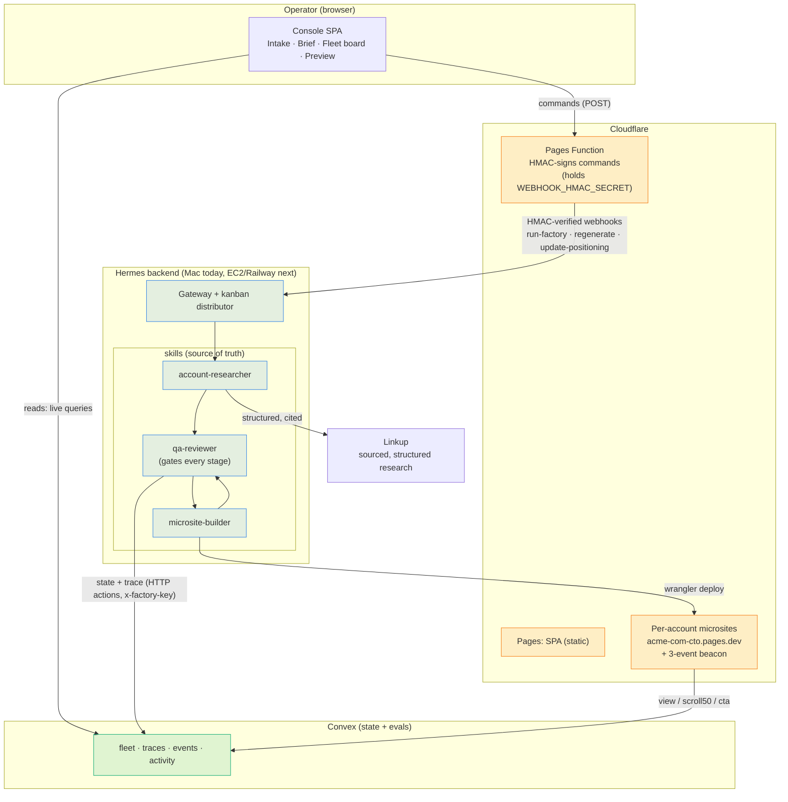
```mermaid
flowchart TB
    subgraph Browser["Operator (browser)"]
        UI["Console SPA<br/>Intake · Brief · Fleet board · Preview"]
    end

    subgraph CF["Cloudflare"]
        Pages["Pages: SPA (static)"]
        Fn["Pages Function<br/>HMAC-signs commands<br/>(holds WEBHOOK_HMAC_SECRET)"]
        Sites["Per-account microsites<br/>acme-com-cto.pages.dev<br/>+ 3-event beacon"]
    end

    subgraph Hermes["Hermes backend (Mac today, EC2/Railway next)"]
        GW["Gateway + kanban distributor"]
        subgraph Skills["skills (source of truth)"]
            R["account-researcher"]
            B["microsite-builder"]
            Q["qa-reviewer<br/>(gates every stage)"]
        end
        GW --> R --> Q
        Q --> B --> Q
    end

    subgraph Data["Convex (state + evals)"]
        Fleet["fleet · traces · events · activity"]
    end

    Linkup["Linkup<br/>sourced, structured research"]

    UI -- "commands (POST)" --> Fn
    Fn -- "HMAC-verified webhooks<br/>run-factory · regenerate · update-positioning" --> GW
    UI -- "reads: live queries" --> Fleet

    R -- "structured, cited" --> Linkup
    Q -- "state + trace (HTTP actions, x-factory-key)" --> Fleet
    B -- "wrangler deploy" --> Sites
    Sites -- "view / scroll50 / cta" --> Fleet

    classDef cf fill:#f6821f22,stroke:#f6821f;
    classDef hermes fill:#3987e522,stroke:#3987e5;
    classDef data fill:#1baf7a22,stroke:#1baf7a;
    class Pages,Fn,Sites cf;
    class GW,R,B,Q hermes;
    class Fleet data;
```

**The read/write split is non-negotiable.** Commands flow *to* Hermes only through HMAC-signed webhooks. The console reads *all* state directly from Convex live queries. Dashboard reads never touch the agent, so the board stays live even if the backend is unreachable.

### Security model

- **Webhooks.** The browser sends unsigned JSON to a same-origin Pages Function. The Function holds the secret, signs the raw body with HMAC-SHA256, and forwards it. Hermes verifies the signature before parsing anything. An unsigned or mis-signed request gets a 401 before the prompt ever runs.
- **Convex writes.** Only `/fleet`, `/trace`, and `/pipelog`, each requiring an `x-factory-key` header. Every mutation is internal. The console has no write path at all.
- **Beacon.** Three anonymous events, nothing else. Per-IP rate limit, the account must exist in the fleet, and the optional detail field is accepted for wire compatibility but never persisted. No fingerprinting, no identity capture.
- **Prompt injection.** Researched web content and intake notes are data. Agent-directed text in either is flagged and ignored.
- **Claims.** The builder can only make product claims that exist in positioning memory. The build gate enforces it.
- **Credentials.** Cloudflare uses a token scoped to Pages Edit only. Convex access from agents is scoped by a deploy key. This repo contains only `.example` env files; it never has and never will contain a real secret.
- **Legal floor.** The target's name appears in text only, never as a logo or trademark styling, with a "Prepared for {Company}" footer and a takedown contact on every page.

<br>

<details>
<summary><b>Frozen data contracts</b> (the stage boundaries, click to expand)</summary>

Stage outputs are frozen JSON contracts. Changing one requires updating the producing skill, the consuming skill, the QA rubric, and `rubric_version` together.

**Researcher output**
```json
{"company":"","domain":"","contact_title":"","vertical":"",
 "reader_lens":"technical|financial|gtm",
 "findings":[{"claim":"","source_url":"","recency":"YYYY-MM",
   "signal_type":"stack|hiring|funding|news|positioning","hook_strength":1}],
 "brand_hints":{"hue_hex":"","register":"","their_phrase":""},
 "likely_objection":"","confidence":0.0}
```

**Builder output**
```json
{"html_path":"sites/{account_id}/index.html",
 "angle_log":{"angle":"cost|speed|risk|talent|competition",
   "because_findings":[0],"objection_addressed":""},
 "design_system":"ledger|terminal|clinic|signal",
 "signature_element":"","word_count":0,"claims_cited":0}
```

**QA verdict**
```json
{"stage":"research|build|deploy","account_id":"","pass":true,
 "failures":[{"check":"","detail":"","severity":"block|warn"}],
 "retry_guidance":""}
```

**Trace line** (JSONL, one per QA invocation, pass or fail)
```json
{"trace_id":"","ts":"","account_id":"","stage":"","input_ref":"","output_ref":"",
 "verdict":{},"rubric_version":"1.0","model":"","cost_usd":0.0,"latency_s":0.0,"retry_of":null}
```

**Webhook payloads** (frontend → Hermes, HMAC-SHA256 over the raw body)
```json
{"rows":[{"company":"","domain":"","contact_title":"","vertical":"","contact_name":"","notes":""}]}
{"account_id":"","mode":"angle|instruction","angle":"","instruction":""}
{"one_liner":"","proof_points":[{"tag":"technical|roi|gtm","text":""}],"tone_rules":[],"forbidden_claims":[],"verticals":[]}
```
</details>

<br>

## Run it yourself

You need a Hermes install, a Convex deployment, a Cloudflare account, and a Linkup key. Hermes is a long-running Python daemon, so it runs on a Mac or a VM, never on Workers.

```bash
git clone https://github.com/V00nikos/microsite-factory && cd microsite-factory
cp .env.example .env                      # fill in: LINKUP_API_KEY, CLOUDFLARE_API_TOKEN, CONVEX_DEPLOY_KEY,
                                          #          FACTORY_KEY, WEBHOOK_HMAC_SECRET, CONVEX_SITE_URL
scripts/install-skills.sh                 # install the four skills into ~/.hermes/skills and verify
npx convex dev                            # deploy the backend and generate client types (keep it running)
cp memory/positioning.template.md ~/.hermes/profiles/factory-worker/memories/MEMORY.md   # then fill it in

cd frontend && npm install
cp .env.example .env.local                # VITE_CONVEX_URL
cp .dev.vars.example .dev.vars            # WEBHOOK_HMAC_SECRET, HERMES_WEBHOOK_BASE (server-side only)
npm run dev:pages                         # SPA + Pages Functions together
```

Then subscribe the three Hermes webhooks with the commands in [`docs/webhook-setup.md`](docs/webhook-setup.md), and prove one account end to end before fanning out:

```bash
scripts/test-webhooks.sh                  # signed round-trips accepted, bad signature rejected
hermes chat -q "Run the factory on fixtures/accounts-sample.csv"
npm test                                  # live-site contract tests: research, build, byte-identical deploy, traces, beacons
```

| Secret | Where it lives | What it scopes |
|---|---|---|
| `LINKUP_API_KEY` | `~/.hermes/.env` | sourced research |
| `CLOUDFLARE_API_TOKEN` | `~/.hermes/.env` | Pages Edit only |
| `CONVEX_DEPLOY_KEY` | `~/.hermes/.env` | agent access to one Convex deployment |
| `FACTORY_KEY` | `~/.hermes/.env` and Convex env | the `x-factory-key` header on `/fleet`, `/trace`, `/pipelog` |
| `WEBHOOK_HMAC_SECRET` | Pages Function env and every `hermes webhook subscribe` | webhook signatures |

<br>

## Repo layout

```
CLAUDE.md                  the agent's brief: non-negotiable rules + frozen data contracts
docs/                      PRD · build tasks · webhook setup · design reference · README media
skills/                    distributor · account-researcher · microsite-builder · qa-reviewer
convex/                    schema · queries · internal mutations · HTTP actions
frontend/                  the operator console (Vite + React SPA) + HMAC-signing Pages Functions
scripts/                   linkup-research.mjs · factory-report.sh · log-stream.mjs · install-skills.sh · test-webhooks.sh
memory/                    positioning-memory template + a filled-in operator example
fixtures/                  sample intake CSVs + a research packet
tests/                     live contract tests for shipped accounts
deploy/railway/            runbook to lift the Hermes backend off the Mac
sites/                     generated microsites, one folder per account (gitignored)
```

<br>

## Status and roadmap

**Working end to end today:** CSV upload → Hermes → live website, with QA gates, eval traces, per-account beacons, and the regenerate-with-instruction loop, all live-updating on the console. The console, Convex, and the microsites run in the cloud. The Hermes backend is the one piece still local, behind a Cloudflare Tunnel, staged to move to EC2 or Railway (runbook in [`deploy/railway/`](deploy/railway/)).

**Known gaps, stated plainly**
- The builder's angle log is written to the trace but not yet mirrored onto the fleet row, so the Preview screen's "because these findings" panel is empty on live data.
- The Preview screen's embedded frame currently clips the site below its header. Use the "Open" button to view the live page until that is fixed.
- Webhook signatures use the V1 scheme with no replay protection. The V2 path (timestamp-bound, 5-minute window) is documented and one flag away.
- The learning loop is instrumented, not learning: engagement per angle is recorded but does not yet reweight angle selection.

**Next**
- Lift Hermes to Railway for a stable webhook URL and retire the tunnel.
- Per-vertical angle win-rate table read from beacon data.
- Sheets and HubSpot import alongside CSV.

<br>

## Built for the GX Hermes Buildathon

Track: **AI as Agency.** The bet is that site generation is solved, and the agency around it (research, gates, traces) is the product.

Built with [Hermes](https://github.com/NousResearch/hermes-agent) by Nous Research, [Convex](https://convex.dev), [Cloudflare Pages](https://pages.cloudflare.com), and [Linkup](https://linkup.so). Console typography: Archivo and IBM Plex Mono.

Licensed under the [MIT License](LICENSE).
