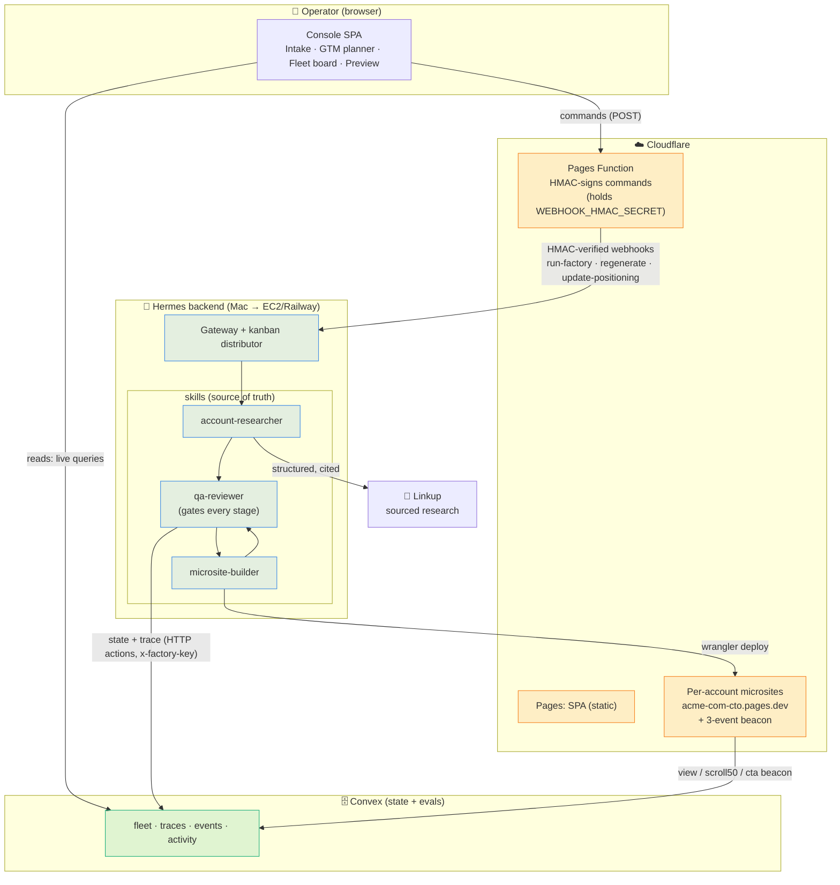

# 🛰️ Microsite Factory

**Research-grade personalized microsites, at volume — one autonomous agency per account.**

A B2B operator pastes an account list; a [Hermes](https://github.com/NousResearch/Hermes)-powered agent
researches each company, writes a personalized microsite grounded in *real, cited* findings, and ships it
to its own live URL — with a **QA gate on every pipeline stage** and an **eval trace behind every decision**.

> Built for the GX Hermes Buildathon · track: *AI as Agency*.

---

## Why

Your top-50 accounts get human attention. The next 500 get merge-tag spam that burns sender reputation.
The gap is **research-grade personalization at volume**: pages that demonstrably understand the account's
stack, funding, hiring, and likely objection — so a CxO reads 15 seconds and thinks *"this is actually about us."*

The factory does that autonomously, and refuses to ship shallow work (confidence &lt; 0.5 → the account is
*blocked*, not faked — restraint is a feature).

## Live

- **Operator console (fleet board):** https://microsite-factory-console.pages.dev
- **Example generated microsites:** `delhivery-com-cfo.pages.dev`, `pinelabs-com-ceo.pages.dev`, `razorpay-com-cto.pages.dev`, … (one `*.pages.dev` per account)

## What it does

1. **Intake** — paste/upload a CSV of accounts (company, domain, contact title, vertical).
2. **Research** — the agent runs sourced web queries (Linkup) and builds a findings packet: ≥5 claims, each with a real `source_url`, plus brand hints and the reader's likely objection.
3. **Build** — it picks one of five storytelling angles, writes a single-file HTML microsite in one of four derived design systems, cites the findings on-page, and embeds a 3-event engagement beacon.
4. **QA at every gate** — a reviewer validates research (spot-checks cited URLs), build (claims come *only* from positioning memory; no invented capabilities; banned "AI-tell" looks auto-fail), and deploy (live URL matches the QA-passed build; beacon fires). Every gate writes an eval trace.
5. **Deploy** — `wrangler` ships each site to its own Cloudflare Pages URL.
6. **Watch** — the console live-updates from Convex: stage, status, cost, first-pass QA rate, blocked reasons *verbatim*, and beacon counts — plus a minute-by-minute activity log of what the agent is doing.

Editing is **strategy, not pixels**: the operator tweaks the *angle* or gives a free-text instruction, and the change re-enters the full builder → QA → deploy pipeline (never a direct HTML edit).

## Architecture



**Read/write split (non-negotiable):** commands flow *to* Hermes only through HMAC-signed webhooks; the
console reads *all* state directly from Convex live queries. Dashboard reads never touch the agent, so the
board stays live even if the backend is unreachable. Pipeline writes to Convex go through fixed HTTP actions
(auth'd with a shared `x-factory-key`), never a general client.

## The agent (four skills)

| Skill | Role |
|---|---|
| **distributor** | Orchestrator — parses intake, one kanban task per account, enforces stage order + budgets ($2/account, max 5 in flight), retries once on QA fail then blocks. |
| **account-researcher** | Reader-lens research (technical / financial / gtm by contact title) via `linkup-research.mjs`. No source → no finding. |
| **microsite-builder** | Angle selection (cost / speed / risk / talent / competition) → fixed narrative spine → single-file HTML in one of four design systems (ledger / terminal / clinic / signal) + beacon. Claims only from positioning memory. |
| **qa-reviewer** | One skill, three stage rubrics. Gates **and** writes an eval trace on every invocation (pass or fail). Fails closed. |

**First-pass QA rate per stage is the factory's single health metric** — every trace is a labeled
(input → output → judgment) example, so the trace log is an eval set by construction.

## Frozen data contracts

Stage outputs are frozen JSON contracts (researcher packet, builder output, QA verdict, trace line) — see
[`CLAUDE.md`](CLAUDE.md). Changing one requires updating the producing skill, the consuming skill, the QA
rubric, and `rubric_version` together.

## Tech stack

- **Frontend:** Vite + React + TypeScript SPA on **Cloudflare Pages**; a Pages **Function** does HMAC signing. Self-hosted fonts (Archivo + IBM Plex Mono), hand-built SVG charts, live/dark themes.
- **State:** **Convex** (live queries drive the board; HTTP actions `/beacon` `/fleet` `/trace` `/pipelog`).
- **Agent:** **Hermes** (Python daemon) — gateway + skills + positioning memory.
- **Research:** **Linkup** structured search. **Sites:** Cloudflare Pages via `wrangler`.

## Repo layout

```
CLAUDE.md                 rules + frozen data contracts (agent's brief)
docs/                     PRD, build tasks, webhook setup, design reference
skills/                   distributor · account-researcher · microsite-builder · qa-reviewer
convex/                   schema · queries · mutations · http actions
frontend/                 the operator console (SPA + Pages Functions)
scripts/                  linkup-research.mjs · factory-report.sh · log-stream.mjs · install-skills.sh · …
memory/                   positioning-memory templates + operator examples
fixtures/                 sample intake CSVs + a research packet
deploy/railway/           runbook to lift the Hermes backend off the Mac
```

## Running it

Prereqs live in `.env` (copy from `.env.example`) and `~/.hermes/.env`: `LINKUP_API_KEY`,
`CLOUDFLARE_API_TOKEN`, `FACTORY_KEY`, `WEBHOOK_HMAC_SECRET`, a Convex deployment, and an Anthropic/OpenAI
model on the Hermes side.

```bash
scripts/install-skills.sh          # install the skill pack into Hermes
npx convex dev                     # deploy backend + generate client types
cd frontend && npm i && npm run dev # run the console (reads live Convex)
```

The frontend deploys to Cloudflare Pages (`wrangler pages deploy`); the Hermes backend runs locally behind a
tunnel for Phase 0, and lifts to EC2/Railway for Phase 1 (see [`deploy/railway/`](deploy/railway/)). Webhook
wiring is documented in [`docs/webhook-setup.md`](docs/webhook-setup.md).

## Status

**Working end-to-end:** CSV upload → Hermes → live website, with QA gates, eval traces, per-account beacons,
and the regenerate-with-instruction loop — all live-updating on the console. Frontend, Convex, and the
generated microsites run in the cloud; the Hermes backend is the one piece still local (Phase 0), staged to
move to EC2/Railway.
